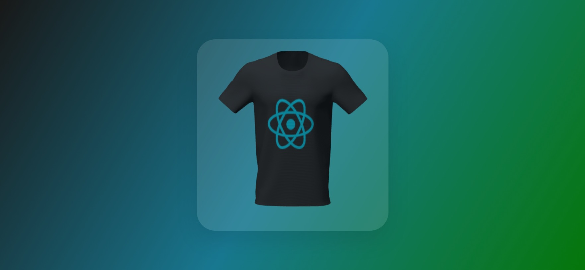

# 3D Mockup - Change Texture With Rotation

A Three.js demo that loads a 3D model, rotates it on the Y axis with variable speed (slow at the front, fast when turning), and swaps its texture each time it completes a half turn.

## What it demonstrates

- **GLTF/GLB** model loading with **GLTFLoader**
- Professional 3-point lighting: ambient + directional (key light) + point lights (rim, fill, side)

- **Speed interpolation** using `THREE.MathUtils.lerp` for natural rotation dynamics
- Dynamic texture swapping on materials with smooth background gradient transition

## Live demo

[Github Page](https://arielleyva.github.io/change-texture-with-rotation/)

## Stack

- **Three.js** (ES modules via CDN)

- HTML5 Canvas / WebGL

## Preview

  
  

